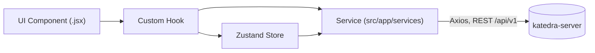

# Katedra Client

[](https://github.com/SAULALEE/katedra-client/actions/workflows/ci.yml)
[](LICENSE)

Frontend for **Katedra**, an AI-driven academic content generator for teachers. React 19,
Vite, Tailwind CSS, Zustand, Stripe Elements.

Spanish version: [README.es.md](README.es.md) · Backend: [katedra-server](https://github.com/SAULALEE/katedra-server)

---

## Live demo

- **App:** https://katedra-client.vercel.app
- **API:** https://katedra-server.onrender.com/api/v1

> **Demo credentials:** not published yet. Register your own account from the app's
> Register page to try it immediately — a public seeded demo (Free + Pro) is planned. The
> API runs on Render's free tier, so the first request after inactivity can take up to a
> minute.

---

## Architecture



Unidirectional flow, zero direct Axios/fetch calls inside components — every request goes
through a Hook and a Service file. Details in
[katedra-server/docs/2_ARCHITECTURE_AND_TECH_STACK.md](https://github.com/SAULALEE/katedra-server/blob/main/docs/2_ARCHITECTURE_AND_TECH_STACK.md).

---

## Tech stack

| | |
|---|---|
| Framework | React 19, Vite |
| Styling | Tailwind CSS, shadcn/ui-style components, Framer Motion |
| State | Zustand |
| HTTP | Axios |
| Payments UI | Stripe Elements (`@stripe/react-stripe-js`) |
| Tests | Node's built-in `node:test` — 68 tests |
| Container | Multi-stage Dockerfile → nginx, SPA fallback routing |

---

## Quickstart (no Doppler account needed)

Requires Node 22+ and npm.

```bash
git clone https://github.com/SAULALEE/katedra-client.git
cd katedra-client
npm install
cp .env.example .env.local
npm run dev:local
```

Opens at `http://localhost:5173`. Leave `VITE_API_BASE_URL` unset in `.env.local` — Vite's
dev server proxies `/api/v1` to `http://localhost:8080`, so it talks to a locally running
[katedra-server](https://github.com/SAULALEE/katedra-server) with no CORS setup. Point it at
the live API instead by setting `VITE_API_BASE_URL=https://katedra-server.onrender.com/api/v1`.

Contributors with access to the project's Doppler org can skip `.env.local` and use
`npm run dev` instead.

---

## Scripts

| Script | What it does |
|---|---|
| `npm run dev` / `dev:local` | Vite dev server, with/without Doppler |
| `npm run build` / `build:local` | Production build, with/without Doppler |
| `npm run preview` / `preview:local` | Preview a production build locally |
| `npm run lint` | ESLint |
| `npm test` | Runs the test suite (`node --test src/`) |

---

## Tests

```bash
npm test
```

68 tests written against Node's built-in `node:test` — no extra test runner dependency. CI
runs this, `npm run lint`, and `npm run build:local` on every push to `main` and `staging`.

---

## API documentation

This client consumes [katedra-server](https://github.com/SAULALEE/katedra-server)'s REST API.
See that repo for Swagger UI (generated live from the code) and a runnable Bruno collection
covering all 37 endpoints.

---

## Project structure

```
src/app/
  components/   shared UI components
  hooks/        one hook per feature area — the only thing components call
  pages/        route-level components
  services/     Axios calls — the only place that talks to the API
  store/        Zustand stores
  utils/        pure helpers
```

---

## Roadmap

See [katedra-server/docs/3_STATUS_AND_ROADMAP.md](https://github.com/SAULALEE/katedra-server/blob/main/docs/3_STATUS_AND_ROADMAP.md)
for what's shipped and what's next across both repos.
